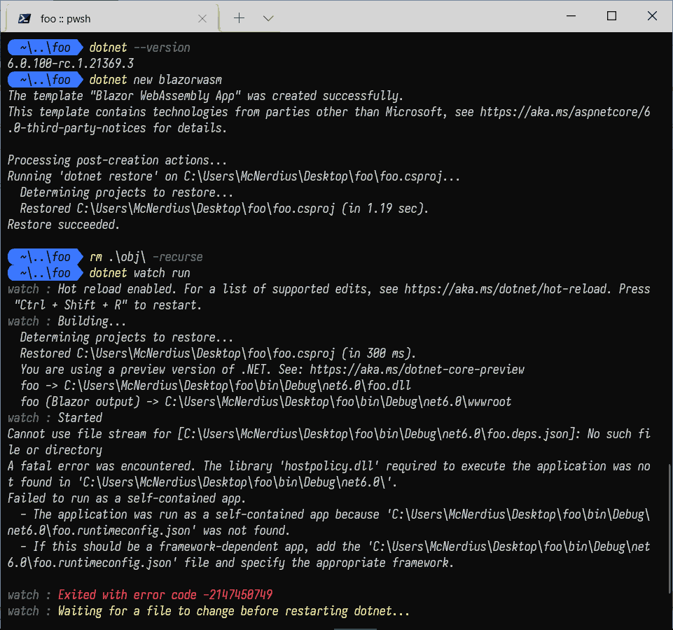

# Create:

- Create a Blazor WASM app: `dotnet new blazorwasm`
- Add a standard dotnet gitignore: `dotnet new gitignore`
- Create & share git repo

# Consume:

- Clone repo
- `dotnet watch run`

# Fail:

```
Cannot use file stream for [C:\Users\McNerdius\Desktop\foo\bin\Debug\net6.0\foo.deps.json]: No such file or directory
A fatal error was encountered. The library 'hostpolicy.dll' required to execute the application was not found in 'C:\Users\McNerdius\Desktop\foo\bin\Debug\net6.0\'.
Failed to run as a self-contained app.

- The application was run as a self-contained app because 'C:\Users\McNerdius\Desktop\foo\bin\Debug\net6.0\foo.runtimeconfig.json' was not found.
- If this should be a framework-dependent app, add the 'C:\Users\McNerdius\Desktop\foo\bin\Debug\net6.0\foo.runtimeconfig.json' file and specify the appropriate framework.
```



The pic is me creating the error locally rather than clone/build but it is the same behavior. These work fine: "`dotnet run`","`dotnet watch run --no-hot-reload`", "`dotnet build; dotnet watch run`".
